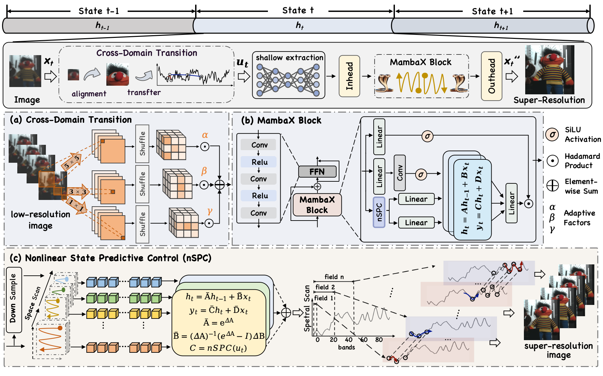

<div align="center">
<h1> MambaX: Image Super-Resolution with State Predictive Control 
</h1> 

Chenyu Li, [Danfeng Hong](https://scholar.google.com/citations?hl=en&user=n7gL0_IAAAAJ&view_op=list_works&sortby=pubdate), Bing Zhang, et al.

([https://ieeexplore.ieee.org/document/11646487](https://ieeexplore.ieee.org/document/11646487))
</div>

## 📄 Abstract
Image super-resolution (SR) is a critical technology for overcoming the inherent hardware limitations of sensors. However, existing approaches mainly focus on directly enhancing the final resolution, often neglecting effective control over error propagation and accumulation during intermediate stages. Recently, Mamba has emerged as a promising approach that can represent the entire reconstruction process as a state sequence with multiple nodes, allowing for intermediate intervention. Nonetheless, its fixed linear mapper is limited by a narrow receptive field and restricted flexibility, which hampers its effectiveness in fine-grained images. To address this, we created a nonlinear state predictive control model MambaX that maps consecutive spectral bands into a latent state space and generalizes the SR task by dynamically learning the nonlinear state parameters of control equations. Compared to existing sequence models, MambaX 1) employs dynamic state predictive control learning to approximate the nonlinear differential coefficients of state-space models; 2) introduces a novel state cross-control paradigm for multimodal SR fusion; and 3) utilizes progressive transitional learning to mitigate heterogeneity caused by domain and modality shifts. Our evaluation demonstrates the superior performance of the dynamic spectrum-state representation model in both single-image SR and multimodal fusion-based SR tasks, highlighting its substantial potential to advance spectrally generalized modeling across arbitrary dimensions and modalities.


## 👀 Overview




## 🛠️ Environment Preparation

Install Python dependencies by running:

```bash
pip install -r requirements.txt

```

and set up the environment by running:

```bash
bash install.sh
```

## 📋 Data Preparation

Datasets are placed under the repository-level `data/` directory.

- **Single-Modal Data**
For example, Pavia ×2 should be organized as:

```text
data/single_modal/
└── pavia_2/
    └── pavia_x2/
        ├── trains/
        │   └── *.mat
        ├── evals/
        │   └── *.mat
        └── pavia_test.mat
```

The same convention is used for CAVE and Chikusei at ×2, ×4, and ×8 scales.

- **Multi-Modal Data**
The expected multimodal data structure is:

```text
data/multimodal/
├── training_wv3/
│   ├── train_wv3.h5
│   ├── valid_wv3.h5
│   └── reduced_examples/
│       └── test_wv3_multiExm1.h5
│
└── training_gf2/
    ├── train_gf2.h5
    ├── valid_gf2.h5
    └── reduced_examples/
        └── test_gf2_multiExm1.h5
```

## 🚀 Training

Example: Pavia ×2

```bash
CUDA_VISIBLE_DEVICES=0 \
python mains.py \
  --subcommand train \
  --cuda 1 \
  --dataset_name pavia \
  --n_scale 2 \
  --n_feats 256 \
  --epochs 150 \
  --learning_rate 0.0003 \
  --gpus 0
```

Example: CAVE ×2

```bash
CUDA_VISIBLE_DEVICES=0 \
python mains.py \
  --subcommand train \
  --cuda 1 \
  --dataset_name cave \
  --n_scale 2 \
  --n_feats 256 \
  --epochs 150 \
  --learning_rate 0.0001 \
  --gpus 0
```

Example: Chikusei ×2

```bash
CUDA_VISIBLE_DEVICES=0 \
python mains.py \
  --subcommand train \
  --cuda 1 \
  --dataset_name Chikusei \
  --n_scale 2 \
  --n_feats 256 \
  --epochs 150 \
  --learning_rate 0.0003 \
  --gpus 0
```

For ×4 or ×8 experiments, change:

```text
--n_scale 4
```

or:

```text
--n_scale 8
```

The paper reports 150 training epochs for the single-modal experiments. The initial learning rate is `1e-4` for CAVE and `3e-4` for Pavia and Chikusei, with the learning rate halved every 30 epochs.

## 🚀 Testing

A checkpoint must be provided explicitly.

Example: Pavia ×2

```bash
CUDA_VISIBLE_DEVICES=0 \
python mains.py \
  --subcommand test \
  --cuda 1 \
  --dataset_name pavia \
  --n_scale 2 \
  --n_feats 256 \
  --checkpoint /path/to/model.pth \
  --gpus 0
```

Replace `/path/to/model.pth` with the checkpoint to be evaluated.

The test procedure computes hyperspectral reconstruction metrics and saves reconstructed outputs for further analysis.


- **Multimodal Fusion Super-Resolution** 

Change to:

```bash
cd multimodal
```

The multimodal training code uses Adam optimization and the HLoss objective implemented in `utilities/utils.py`.

The paper reports 500 epochs for multimodal fusion experiments with an initial learning rate of `7e-4`.


## WV3 Training

The official WV3 model configuration used by this repository is:

```text
method = SDL_ms
band   = 8
dim    = 32
```

With the default dataset structure, training can be started with:

```bash
CUDA_VISIBLE_DEVICES=0 \
python train_w.py \
  --gpu_id 0 \
  --method SDL_ms \
  --band 8 \
  --dim 32 \
  --max_epoch 500 \
  --learning_rate 0.0007
```

The default data locations are:

```text
data/multimodal/training_wv3/train_wv3.h5
data/multimodal/training_wv3/valid_wv3.h5
data/multimodal/training_wv3/reduced_examples/test_wv3_multiExm1.h5
```

Custom paths can be supplied using:

```text
--data_path_train
--data_path_test
--reduced_test_path
--outf
```

---

## GF2 Training

The official GF2 model configuration used by this repository is:

```text
method = SDL_msg
band   = 4
dim    = 24
```

Start training with:

```bash
CUDA_VISIBLE_DEVICES=0 \
python train_g.py \
  --gpu_id 0 \
  --method SDL_msg \
  --band 4 \
  --dim 24 \
  --max_epoch 500 \
  --learning_rate 0.0007
```

The default data locations are:

```text
data/multimodal/training_gf2/train_gf2.h5
data/multimodal/training_gf2/valid_gf2.h5
data/multimodal/training_gf2/reduced_examples/test_gf2_multiExm1.h5
```

---

# Multimodal Testing

The cleaned test entry is:

```text
multimodal/test.py
```

It supports both WV3 and GF2 reduced-resolution evaluation.

## WV3

From the `multimodal/` directory:

```bash
CUDA_VISIBLE_DEVICES=0 \
python test.py \
  --dataset wv3 \
  --weight checkpoints/wv3/model.pth \
  --device cuda:0
```

## GF2

```bash
CUDA_VISIBLE_DEVICES=0 \
python test.py \
  --dataset gf2 \
  --weight checkpoints/gf2/model.pth \
  --device cuda:0
```

The default reduced-resolution H5 file is selected automatically according to `--dataset`.

A custom test file can be specified with:

```bash
--file_path /path/to/test.h5
```

A custom output directory can be specified with:

```bash
--save_dir /path/to/output
```

For `test.py`, relative paths supplied through the command line are interpreted relative to the **repository root**, not relative to the `multimodal/` directory.

The multimodal training scripts save complete PyTorch model objects using `torch.save(model, ...)`. Therefore, the test script expects a compatible complete-model checkpoint. PyTorch version differences can affect loading of serialized full-model checkpoints.

---


## 📝 Citation

If you find our project helpful, please cite our paper:

C. Li, D. Hong, B. Zhang, et, al. "MambaX: Image Super-Resolution with State Predictive Control," IEEE Transactions on Pattern Analysis and Machine Intelligence, doi: 10.1109/TPAMI.2026.3721958.

```bibtex
@ARTICLE{11646487,
  author={Li, Chenyu and Hong, Danfeng and Zhang, Bing and Pan, Zhaojie and Yokoya, Naoto and Chanussot, Jocelyn},
  journal={IEEE Transactions on Pattern Analysis and Machine Intelligence}, 
  title={MambaX: Image Super-Resolution with State Predictive Control}, 
  year={2026},
  volume={},
  number={},
  pages={1-15},
  doi={10.1109/TPAMI.2026.3721958}}
```

---

## 📜 Licensing

Copyright © 2026 Danfeng Hong

This program is free software: you can redistribute it and/or modify it under the terms of the GNU General Public License as published by the Free Software Foundation, version 3.

---

## 📧 Contact Information

**Danfeng Hong**: hongdanfeng1989@gmail.com  
School of Automation, Southeast University, 211189 Nanjing, China.

---
